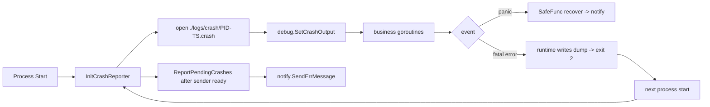

# coroutines

协程工具包，覆盖 **协程级 panic 兜底**、**进程级 fatal error 兜底**、**并发控制** 三块能力。

---

## 1. Go 错误的四级模型

设计前先统一术语，整库的错误处理与告警都基于这套分级：

| 等级 | 名称 | 谁触发 | 进程能否存活 | 能否在进程内捕获 | go-lib 应对 |
|---|---|---|---|---|---|
| L1 | error | 业务/IO | 是，需手动处理 | 是，`if err != nil` | 调用方自处理 |
| L2 | panic | runtime 异常 / 显式 `panic()` | 默认死，recover 可救 | 是，**仅在抛出协程的 defer 中** `recover()` | `SafeGo` / `SafeFunc` |
| L3 | fatal error | `runtime.throw` / `runtime.fatal` | **必死**，跳过所有 defer | **完全不能拦截** | `InitCrashReporter` 落盘 + `ReportPendingCrashes` 下次启动补报 |
| L4 | 系统级处决 | SIGKILL / OOMKilled / 断电 | 瞬死，零遗言 | 完全不能 | 进程外监控（systemd / k8s / Prometheus） |

L3 的典型场景：

- `fatal error: concurrent map writes`
- `fatal error: all goroutines are asleep - deadlock!`
- `runtime: goroutine stack exceeds ... limit` / stack overflow
- `runtime: out of memory`
- `sync: unlock of unlocked mutex` / `sync: Unlock of unlocked RWMutex`
- cgo 路径触发的 SIGSEGV / SIGBUS（多数情况）

> 关键：panic 是**协程级**事件，只有抛出它的那个 goroutine 的 defer 能 recover；fatal 是**进程级**事件，跳过所有 defer，无任何挽救手段。

---

## 2. L2：协程级 panic 兜底

### API

```go
func SafeGo(ctx context.Context, F func(ctx context.Context))
func SafeFunc(ctx context.Context, F func(ctx context.Context))
```

`SafeGo` = `go SafeFunc(ctx, F)`。`SafeFunc` 在 defer 中 `recover()`，根据 panic 值类型分别处理：

- panic 值是 `error`：`errors.WithStack` 保留底层信息
- panic 值是其它类型：`errors.Errorf("panic: %v", v)` 转字符串
- 最终用 `errors.WithMessage` 拼上 `debug.Stack()`，避免 recover 处吃掉 panic 现场
- 通过 `notify.SendErrMessage` 告警

### 使用约束

- **每个 `go` 关键字都必须包**。少包一个就漏一个，runtime 会把整个进程带走。
- 第三方库自起的 goroutine（如 gin handler、gocron job）需要在框架钩子里再次包一层。
- `recover()` 只能拦 L2，**永远拦不住 L3 fatal**——不要把 SafeGo 当万能护盾。

### 示例

```go
coroutines.SafeGo(ctx, func(ctx context.Context) {
    // 任意业务逻辑：nil deref / 越界 / 显式 panic 都会被捕获并告警
})
```

---

## 3. L3：进程级 fatal error 兜底

### 原理

Go 1.23+ 提供 `runtime/debug.SetCrashOutput(f, opts)`：runtime 在打 fatal 时除了打到 stderr，还会把 goroutine traceback 复制写入 `f`。本进程必死，但 dump 文件留下了"遗言"，下次启动读取并通过 notify 通道补报。



### API

```go
func InitCrashReporter(opts ...CrashOption) error
func ReportPendingCrashes(ctx context.Context) error

type CrashRecord struct {
    File      string
    Pid       int
    StartedAt time.Time
    Reason    string
    Raw       []byte
    Truncated bool
}

func WithCrashDir(dir string) CrashOption          // 默认 "./logs/crash"
func WithTraceback(level string) CrashOption       // "single"/"all"/"system"/"crash"，默认 "all"
func WithMaxFileBytes(n int64) CrashOption         // 默认 256 KB
func WithKeepUploaded(d time.Duration) CrashOption // 默认 7 天
func WithCrashTitle(title string) CrashOption      // 默认 "Process Crashed"
func WithCrashUploader(fn func(context.Context, *CrashRecord) error) CrashOption
```

顶层入口（推荐）：

```go
lib.InitCrashReporter(opts...)
lib.ReportPendingCrashes(ctx)
```

### 推荐：零定制接入模板

每个项目 `main.go` 直接复制下面 4 行，零配置就具备 fatal 兜底能力，目录会按 serverName 自动隔离避免多实例互踩：

```go
lib.Init("my-svc", "prod")
lib.InitLog(logger)

flush := lib.BootstrapCrashCapture()      // 第 1 阶段：注册 SetCrashOutput

lib.InitGlobalSender(sender)
flush(coroutines.NewContext("crash-report")) // 第 2 阶段：补报上次崩溃
```

`BootstrapCrashCapture` 的默认行为：
- dump 目录：`./logs/crash/<serverName>/`（serverName 为空时退回 `./logs/crash`）
- traceback：`all`（含全 goroutine 栈）
- 单文件读取上限：256 KB
- `.uploaded` 保留期：7 天
- 默认 uploader：`notify.SendErrMessage`，与 SafeGo 的 panic 告警同通道
- 任何错误均静默吞掉只写日志，**不会让业务起不来**

需要自定义？把 `coroutines.WithXxx` 选项透传进去即可：

```go
flush := lib.BootstrapCrashCapture(
    coroutines.WithCrashDir("/data/crash/my-svc"),
    coroutines.WithMaxFileBytes(1024 * 1024),
    coroutines.WithCrashUploader(func(ctx context.Context, rec *coroutines.CrashRecord) error {
        return sentry.CaptureMessage(rec.Render())
    }),
)
```

### 底层调用顺序（手动接入时参考）

如果不用 `BootstrapCrashCapture` 想自己组装：

```go
lib.Init("my-svc", "prod")
lib.InitLog(logger)

// crash reporter 必须最早，至少在任何业务 goroutine 启动之前
if err := lib.InitCrashReporter(
    coroutines.WithCrashDir("./logs/crash"),
); err != nil {
    log.Fatal(err)
}

// notify sender 就绪后再补报
lib.InitGlobalSender(sender)
_ = lib.ReportPendingCrashes(coroutines.NewContext("crash-report"))
```

约束：
- `InitCrashReporter` 越晚注册，注册前发生的 fatal 越多被遗漏，只能进 stderr。
- `ReportPendingCrashes` 必须在 sender 就绪后调用，否则默认 uploader 取不到 sender，告警丢失。
- 重复调用 `InitCrashReporter` 是幂等的（第二次直接返回 nil），不会覆盖已注册的 fd。

### 工作细节

- dump 文件名：`<pid>-<yyyymmdd_HHMMSS>.crash`，同主机多实例互不冲突。
- 扫描时**当前进程正在写入的文件会被排除**（按文件名 pid 比对），避免上报"自己还没崩"的空文件。
- 上报成功后重命名为 `*.crash.uploaded`，避免下次重复发送；失败则保留下次重试。
- 空 dump（上次进程正常退出，runtime 没写）会**静默归档**，不上报。
- 超过 `maxFileBytes` 的 dump 会截断后上报，`CrashRecord.Truncated = true`，原文件不动以备人工排查。
- `keepUploaded` 之外的 `*.uploaded` 自动清理。
- **dump 目录不要求是空的**：第一次部署会自动创建；后续启动看到历史 `.crash` 才上报，看不到就什么都不做。手动清空 dir 等于"忘掉上次事故"，无害。

### 多服务共用同一 crash dir 的陷阱

若同主机跑多个服务、又**用同一个 crash dir**，B 进程启动时可能扫到 A 进程仍在写的 `.crash` 文件（pid 不等于自己），误以为是历史崩溃从而误报。规避方法（按推荐顺序）：

1. **首选**：用 `BootstrapCrashCapture()`，默认 dir 自动加 `<serverName>` 子目录隔离，零心智负担。
2. 手动指定 `WithCrashDir("/data/crash/<unique>")`，每个服务独立目录。
3. 单实例服务可以共用，但建议把同主机的多实例（如蓝绿、扩容副本）至少按实例 id 区分目录。

### 自定义上报通道

默认 uploader 走 `notify.SendErrMessage`，与 panic 告警同通道。也可以推到 Sentry / 钉钉 / 飞书：

```go
lib.InitCrashReporter(
    coroutines.WithCrashUploader(func(ctx context.Context, rec *coroutines.CrashRecord) error {
        return sentry.CaptureMessage(rec.Render())
    }),
)
```

uploader 返回 error 表示本次上报失败，框架会保留原文件等下次启动重试。

---

## 4. L4：能力边界

以下场景 **本库无能为力**，必须靠进程外监控兜底：

- `kill -9` / SIGKILL：内核直接处决，runtime 来不及写 dump。
- 容器 OOMKilled：cgroup memory limit 触发，行为同上；且容器销毁后即便写过 dump 也会随 emptyDir 一起消失。**生产环境务必把 `WithCrashDir` 指向持久卷**（PVC / hostPath / 共享存储）。
- 整机断电、宿主机宕机、磁盘满写日志卡死。
- 运行 `crash` 级 GOTRACEBACK 时 runtime 会调用 `os.Exit(2)` 之前 SIGABRT，dump 仍然能写，但 core file 由 OS 控制。

推荐配套：

- systemd：`OnFailure=` + `Restart=on-failure`，按 restart count 告警。
- k8s：Liveness/Readiness 探针 + `restartCount` 监控 + container_oom_events_total 指标。
- Prometheus：`up == 0` / `process_start_time_seconds` 突变 → 告警。

---

## 5. 其它工具

### Retry

```go
coroutines.Retry(ctx, func(ctx) error { ... }, maxRetries...)
```

无限重试或限定次数；每次失败都通过 notify 告警（自带 sleep 由调用方控制）。

### NewContext

构造一个带 ServerName / Env / RequestID 的 background context，用于后台任务。

### ConcurrentProcessor / ConcurrentProcessorChan

固定并发数的工作池；内部用 `SafeGo` 包装，单个 worker panic 不会影响其它 worker。

### GetStructName

反射拿到结构体名（带 `*` 前缀表示指针），常用于日志 / 监控标签。

---

## 6. FAQ

**Q：SafeGo 已经有 recover 了，还需要 InitCrashReporter 吗？**
A：必须要。`recover()` 只能拦 L2 panic；L3 fatal（并发 map 写、死锁、栈溢出等）跳过所有 defer，不通过 InitCrashReporter 落盘就完全没痕迹。

**Q：InitCrashReporter 可以多次调用吗？**
A：幂等，第二次直接返回 nil，不会覆盖已注册的 fd。

**Q：dump 文件越攒越多怎么办？**
A：成功上报后会重命名为 `*.crash.uploaded`，并按 `WithKeepUploaded`（默认 7 天）过期清理。未上报成功的 `.crash` 不会清理，避免漏报。

**Q：为什么不在 InitCrashReporter 内部自动起一个 goroutine 自动上报？**
A：因为 sender 的就绪时机由业务控制，自动上报需要轮询 + 重试，反而引入复杂度。显式调用 `ReportPendingCrashes` 简单可控。

**Q：dump 目录必须是空的吗？**
A：不必。库只关心 `.crash` 后缀文件，其它文件忽略；当前进程文件会被自动排除；空文件会静默归档不告警。直接用一个常驻目录即可。

**Q：每个项目都要复制一份配置吗？**
A：用 `lib.BootstrapCrashCapture()` 即可，全部默认值，不需要每个项目改任何东西。dump 目录会按 serverName 自动隔离。

**Q：dump 里看不到 "fatal error: concurrent map writes" 这一行？**
A：runtime 在打 fatal 时通过 `print()` 直接写 stderr 的那行不会进 crashFD，crashFD 收到的是后续 goroutine 栈 dump。栈帧里通常会出现 `internal/runtime/maps.fatal` / `runtime.gopanic` 等可反推根因的函数名，足够定位问题。完整的 stderr 输出仍然会被运维侧 stdout/stderr 采集系统抓走。
